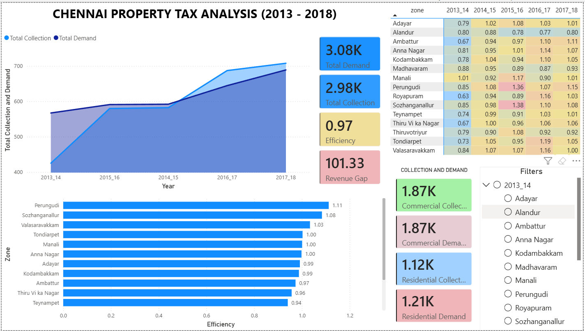

# Chennai Property Tax Analysis (2013–2018)

## Objective
Analyze tax collection efficiency across zones and identify revenue leakage.

## Dataset
Ward-level property tax data (2013–2018)

## Key KPI
Efficiency = Collection / Demand

## Key Findings
- Some zones show low efficiency (<0.8) → revenue leakage
- Some zones show efficiency >1 → data inconsistency / arrears
- High variation across zones

## Tools Used
- Python
- Pandas
- Matplotlib / Seaborn

## Results
- Identified high-risk zones
- Built efficiency heatmap
- Created zone ranking system

## Final Story
This project analyzes property tax data from Chennai between 2013 and 2018 to evaluate how effectively the municipal corporation collects revenue across different zones. By comparing the expected tax (demand) with the actual amount collected, a key performance metric—collection efficiency—was derived to measure system effectiveness. The analysis reveals significant variation across zones: some areas consistently achieve near-optimal efficiency, indicating strong compliance and accurate tax estimation, while others exhibit low efficiency, highlighting substantial revenue leakage. Additionally, multiple zones show efficiency values greater than one, suggesting the presence of arrears recovery, penalties, or inconsistencies in demand estimation. Through data cleaning, transformation, exploratory analysis, and feature engineering, the project identifies high-risk zones, uncovers systemic inefficiencies, and provides actionable insights to improve tax collection strategies. Overall, the findings emphasize the need for better demand estimation, targeted enforcement in underperforming areas, and more transparent accounting practices to enhance municipal revenue management.
